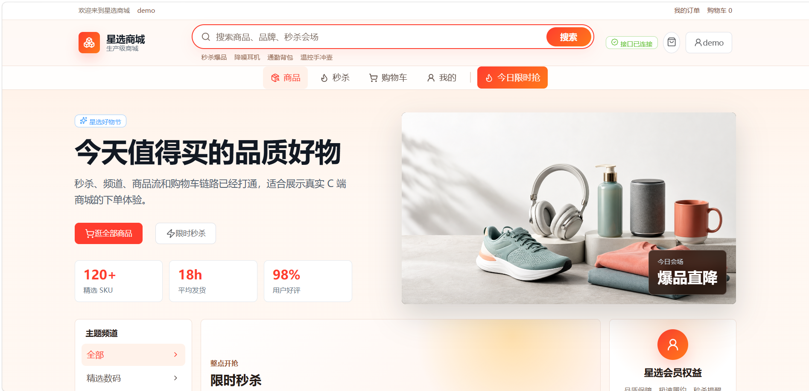
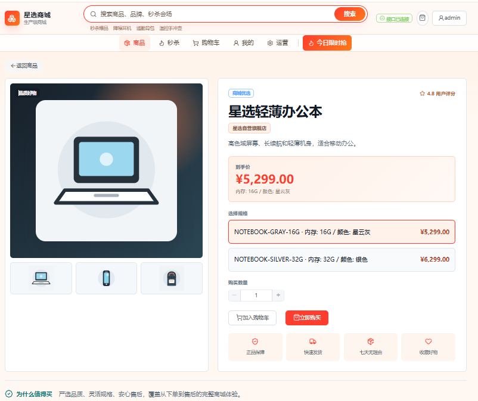
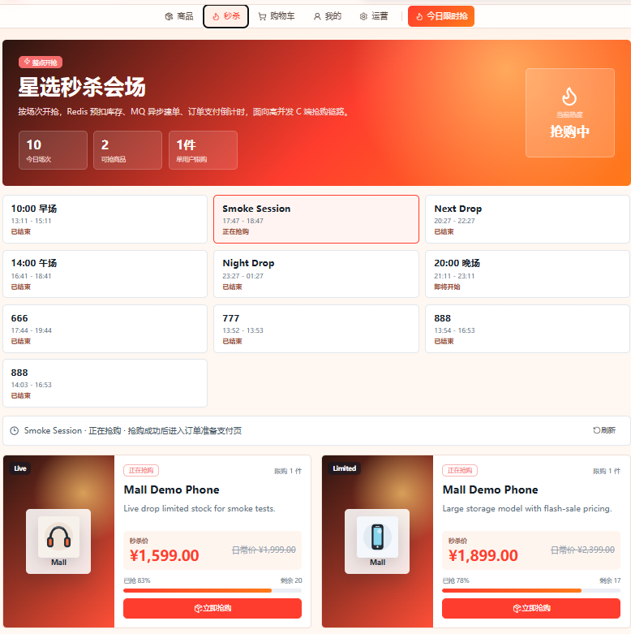
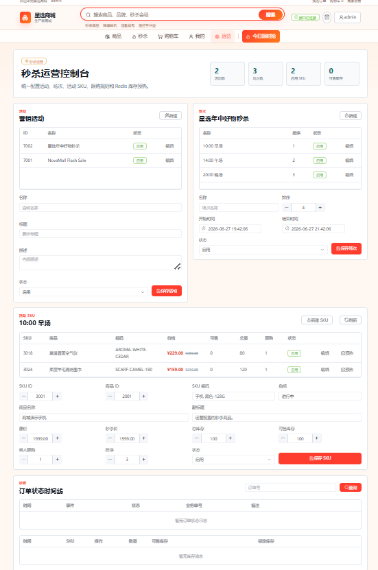
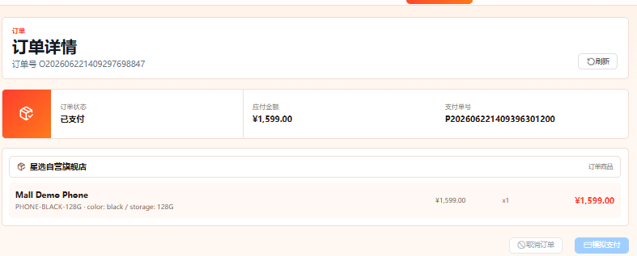

# Production-Oriented Flash-Sale Mall

Spring Cloud Alibaba microservice mall focused on high-concurrency flash-sale ordering, C-side shopping, B-side seckill operations, and production-readiness documentation.

## Modules

- `mall-gateway`: unified API gateway and JWT guard
- `mall-auth`: login and token refresh
- `mall-user`: user registration and current user profile
- `mall-product`: category, product, and SKU query APIs
- `mall-promotion`: promotion and seckill activity/session/SKU catalog plus internal validation APIs
- `mall-cart`: cart item management and checkout
- `mall-order`: order creation, detail, cancel, payment status update, seckill token, queueing, and reservation flow
- `mall-inventory`: stock lock, release, and deduct
- `mall-payment`: mock payment, payment detail, and order-paid event publishing
- `mall-ai`: AI customer assistant, RAG knowledge base, and read-only order Agent
- `mall-web`: Vue 3 front-end for product, cart, order, payment, and seckill acceptance
- `mall-common`, `mall-common-web`, `mall-common-security`: shared response, exception, trace, and JWT support

## Implemented Capabilities

- Product read cache: Redis cache for product detail, SKU detail, and category list, with short TTL empty values and Redis rebuild locks.
- Order consistency: payment still calls order synchronously for the paid state transition, then writes RocketMQ events to a local outbox for scheduled async publishing; order payment handling is idempotent.
- Inventory event skeleton: order publishes `InventoryDeductedEvent` after paid inventory deduction.
- Seckill activity flow: promotion-owned activity/session/SKU validation, short-lived seckill token, Redis Lua token plus stock plus duplicate-buy guard, and outbox-backed async order creation through RocketMQ.
- Seckill order consistency: server-side seckill price snapshot, `requestId` idempotency, and `oms_seckill_reservation` records that release Redis seckill stock when unpaid orders are canceled or expired.
- Seckill catalog: dedicated promotion service for seckill activity sessions and activity SKU listing, consumed by the C-side flash-sale page. Seed data uses relative times so a fresh local database has a running session.
- Seckill stock reconciliation: promotion service periodically reads Redis activity stock and writes it back to `promo_seckill_sku.available_stock`, so C-side catalog stock can converge after high-concurrency pre-deducts.
- Seckill admin APIs: admin-guarded activity, session, and activity SKU configuration endpoints under `/api/promotions/admin/seckill/**`.
- Order admin diagnostics: admin-guarded order status timeline endpoint backed by `oms_order_status_log`.
- Seckill admin console: `/admin/seckill` front-end page for activity/session/SKU operations, Redis stock preheat, recent operation audit logs, order status timeline diagnostics, and inventory flow diagnostics.
- Governance: Actuator health/metrics/prometheus exposure, Springdoc OpenAPI for MVC services, gateway Sentinel rules for seckill/login/product traffic, and dedicated seckill Micrometer counters.
- Inventory auditability: `wms_stock_flow` records stock lock/release/deduct snapshots for order-level troubleshooting and reconciliation.
- Integration testing: Testcontainers MySQL coverage for the inventory state machine; the test is skipped automatically when Docker is unavailable.
- Production-hardening in progress: explicit front-end mock profile, role claim propagation, admin-guarded seckill stock initialization, internal API blocking at the gateway, order request idempotency, stock lock uniqueness, local message retry, environment-driven JWT/CORS config.

## Project Documentation

- [Architecture](docs/architecture.md)
- [Requirements Review](docs/requirements-review.md)
- [Runbook](docs/runbook.md)
- [Performance Testing](docs/performance-testing.md)
- [Observability](docs/observability.md)
- [Sentinel Gateway Flow Control](docs/sentinel.md)
- [RBAC And Access Governance](docs/rbac-governance.md)
- [Pre-Launch Risk Assessment](docs/pre-launch-risk-assessment.md)
- [Production Risk Register](docs/risk-register.md)
- [GitHub Release Guide](docs/github-release.md)
- [Production Readiness Audit](docs/production-readiness-audit.md)
- [Acceptance Report](docs/acceptance-report.md)
- [Project Summary](docs/project-summary.md)

## Screenshots

| C-side mall | Product detail |
| --- | --- |
|  |  |

| Flash sale channel | Admin seckill console |
| --- | --- |
|  |  |

| Order detail |
| --- |
|  |

## Middleware In A VM

The default local acceptance workflow is:

```text
VM Docker middleware + Windows/IDEA Java services + local Vue dev server
```

The middleware stack is MySQL, Redis, Nacos, RocketMQ, RocketMQ Dashboard, Sentinel Dashboard, and Milvus. MySQL/Redis/RocketMQ are the data and message middleware; Nacos provides service discovery; Sentinel provides traffic protection and dashboard visibility; Milvus stores AI knowledge vectors. The compose stack also runs a one-shot RocketMQ topic initializer for `order-paid-topic`, `seckill-order-topic`, and `inventory-deducted-topic`.

The VM-side Docker Compose package is in [`deploy/`](deploy/README.md). Copy that directory to the VM, create `.env` from `.env.example`, set `MALL_VM_HOST` to the current VM IP, then run `docker compose up -d --build`.

Use the VM middleware address explicitly. VM IPs are environment-specific, so replace `<your-vm-ip>` with the address shown by your VM:

```powershell
$env:MALL_VM_HOST="<your-vm-ip>"
$env:MALL_NACOS_ADDR="${env:MALL_VM_HOST}:8848"
$env:MALL_MYSQL_HOST="${env:MALL_VM_HOST}"
$env:MALL_MYSQL_PORT="3306"
$env:MALL_MYSQL_USERNAME="root"
$env:MALL_MYSQL_PASSWORD="root"
$env:MALL_REDIS_HOST="${env:MALL_VM_HOST}"
$env:MALL_REDIS_PORT="6379"
$env:MALL_ROCKETMQ_NAME_SERVER="${env:MALL_VM_HOST}:9876"
$env:MALL_SENTINEL_DASHBOARD="${env:MALL_VM_HOST}:8858"
$env:MALL_JWT_SECRET="replace-with-at-least-32-byte-secret"
$env:MALL_PAYMENT_CALLBACK_SECRET="replace-with-payment-callback-secret"
$env:MALL_SECURITY_FAIL_ON_DEFAULT_SECRET="false"
```

`root / root`, empty Redis password, the JWT placeholder, and the payment callback placeholder are local acceptance values only. For a shared or deployed environment, use a dedicated MySQL account, enable middleware authentication as needed, inject secrets through environment variables or a secret manager, and set `MALL_SECURITY_FAIL_ON_DEFAULT_SECRET=true`.

In IDEA, set these in each backend service run configuration. Do not omit `MALL_VM_HOST` or `MALL_MYSQL_HOST`; otherwise services can fall back to `localhost`.

Verify VM middleware connectivity before starting Java services:

```powershell
powershell -ExecutionPolicy Bypass -File .\scripts\check-vm-middleware.ps1
```

If the VM MySQL already exists but a service database is missing, create the required mall databases idempotently:

```powershell
powershell -ExecutionPolicy Bypass -File .\scripts\init-vm-databases.ps1
```

If an existing VM RocketMQ stack was started before the topic initializer was added, run this once on the VM:

```bash
cd deploy
docker compose up rocketmq-init
```

Start one backend service from a shell with the VM environment already injected:

```powershell
powershell -ExecutionPolicy Bypass -File .\scripts\start-service-vm.ps1 -Service mall-user
```

Open these VM ports to the Windows host:

- `3306` MySQL
- `6379` Redis
- `8848`, `9848`, `9849` Nacos service ports
- `8849` Nacos console
- `9876`, `10909`, `10911` RocketMQ
- `8088` RocketMQ Dashboard
- `8858` Sentinel Dashboard
- `19530`, `9091` Milvus

## Optional Local Middleware

```powershell
cd deploy
docker compose up -d
```

This starts MySQL, Redis, Nacos, RocketMQ NameServer, RocketMQ Broker, RocketMQ Dashboard, Sentinel Dashboard, and Milvus on the current machine. This is optional; the normal workflow for this repository can use middleware already running in the VM.

Optional all-in-one Docker validation:

```powershell
cd deploy
docker compose -f docker-compose.yml -f docker-compose.apps.yml up -d --build
```

This builds all Java service images from the root `Dockerfile` and starts them on their configured ports. This is for release reproducibility on a Docker-enabled machine, not the default VM-middleware workflow.

Optional observability stack:

```powershell
cd deploy
docker compose --profile observability up -d
```

This also starts Prometheus on `http://localhost:9090` and Grafana on `http://localhost:3000`. Sentinel Dashboard is part of the default middleware stack and is available on `http://localhost:8858`.

## Starting Middleware In A VM

Run the middleware stack inside a Linux VM, then keep the Java services on Windows/IDEA.

On the VM:

```bash
sudo apt update
sudo apt install -y docker.io docker-compose-plugin
sudo systemctl enable --now docker
```

Copy this repository, or at least the `deploy` directory, to the VM. Then start the middleware:

```bash
cd deploy
export MALL_VM_HOST=192.168.56.101
docker compose up -d
docker compose ps
```

Set `MALL_VM_HOST` to the VM IP before starting Docker Compose. RocketMQ broker uses it as `brokerIP1`, so Java services running on Windows can connect back to the broker. You can override only RocketMQ with `MALL_ROCKETMQ_BROKER_IP`.

Open these VM ports to the Windows host:

- `3306` MySQL
- `6379` Redis
- `8848`, `9848`, `9849` Nacos service ports
- `8849` Nacos console
- `9876`, `10909`, `10911` RocketMQ
- `8088` RocketMQ Dashboard
- `8858` Sentinel Dashboard
- `19530`, `9091` Milvus

Find the VM IP:

```bash
ip addr
```

On Windows, verify connectivity. Replace `192.168.56.101` with your VM IP:

```powershell
Test-NetConnection 192.168.56.101 -Port 3306
Test-NetConnection 192.168.56.101 -Port 8848
```

When running Java services locally, pass the VM IP through environment variables:

```powershell
$env:MALL_VM_HOST="192.168.56.101"
$env:MALL_MYSQL_USERNAME="root"
$env:MALL_MYSQL_PASSWORD="root"

java -jar mall-user\target\mall-user-0.1.0-SNAPSHOT.jar
```

All service configs support these variables. IP values are intentionally not fixed in the project because each developer's VM address can differ:

- `MALL_VM_HOST`: shared VM host for Nacos and MySQL
- `MALL_NACOS_ADDR`: override Nacos address, for example `192.168.56.101:8848`
- `MALL_MYSQL_HOST`: override MySQL host; this is environment-specific and should point to your VM or deployed database host
- `MALL_MYSQL_PORT`: override MySQL port, default `3306`
- `MALL_MYSQL_USERNAME`: default `root` for local acceptance only; use a least-privilege account outside local VM testing
- `MALL_MYSQL_PASSWORD`: default `root` for local acceptance only; inject real passwords through environment variables or secret management
- `MALL_REDIS_HOST`: override Redis host; this is environment-specific
- `MALL_REDIS_PORT`: default `6379`
- `MALL_REDIS_PASSWORD`: default empty for local acceptance only
- `MALL_ROCKETMQ_NAME_SERVER`: override RocketMQ NameServer, for example `192.168.56.101:9876`
- `MALL_ROCKETMQ_BROKER_IP`: broker IP advertised to Java clients when starting Docker Compose
- `MALL_SENTINEL_DASHBOARD`: optional Sentinel dashboard address, default `${MALL_VM_HOST}:8858`
- `MALL_MILVUS_HOST`: override Milvus host, default `${MALL_VM_HOST}`
- `MALL_MILVUS_PORT`: override Milvus gRPC port, default `19530`
- `MALL_AI_DEEPSEEK_API_KEY`: DeepSeek chat API key for `mall-ai`
- `MALL_AI_EMBEDDING_API_KEY`: OpenAI-compatible embedding API key for `mall-ai`

## Run Services

Start each service from the repository root:

```powershell
mvn -pl mall-user spring-boot:run
mvn -pl mall-auth spring-boot:run
mvn -pl mall-product spring-boot:run
mvn -pl mall-promotion spring-boot:run
mvn -pl mall-cart spring-boot:run
mvn -pl mall-order spring-boot:run
mvn -pl mall-inventory spring-boot:run
mvn -pl mall-payment spring-boot:run
mvn -pl mall-ai spring-boot:run
mvn -pl mall-gateway spring-boot:run
```

Or start all packaged backend services against VM middleware in the background:

```powershell
.\mvnw.cmd -q -DskipTests package
powershell -ExecutionPolicy Bypass -File .\scripts\start-backend-vm.ps1
```

Stop background services:

```powershell
powershell -ExecutionPolicy Bypass -File .\scripts\stop-backend.ps1
```

Service ports:

| Service | Port |
| --- | --- |
| `mall-gateway` | 8080 |
| `mall-auth` | 8081 |
| `mall-user` | 8082 |
| `mall-product` | 8083 |
| `mall-order` | 8084 |
| `mall-inventory` | 8085 |
| `mall-cart` | 8086 |
| `mall-payment` | 8087 |
| `mall-promotion` | 8089 |
| `mall-ai` | 8090 |

## Run Front-End

Start the Vue front-end after the gateway is running:

```powershell
cd mall-web
npm install
npm run dev
```

Open:

```text
http://localhost:5173
```

The Vite dev server proxies `/api` to `http://localhost:8080`, so the browser only needs the front-end URL during acceptance.

Admin console:

```text
http://localhost:5173/admin/seckill
```

Use `admin / 123456` for local backend acceptance. In explicit mock mode, logging in with username `admin` also enables the admin console.

Production-like front-end behavior calls the real backend only. Local UI-only demo mode is explicit:

```powershell
cd mall-web
Copy-Item .env.mock .env.local
npm run dev
```

Do not enable `VITE_USE_MOCK=true` for production-like acceptance.

## Smoke Test

After backend services and the front-end gateway are running, the scripted smoke check is:

```powershell
powershell -ExecutionPolicy Bypass -File .\scripts\smoke-api.ps1
```

To run the real seckill submission path and create an order:

```powershell
powershell -ExecutionPolicy Bypass -File .\scripts\smoke-api.ps1 -RunSeckill
```

For a small local multi-user seckill acceptance run without k6:

```powershell
powershell -ExecutionPolicy Bypass -File .\scripts\load-seckill.ps1 -Users 10 -Concurrency 3 -Stock 20
```

Generate showcase data after the backend is running:

```powershell
powershell -ExecutionPolicy Bypass -File .\scripts\seed-demo-data.ps1
```

Base demo data is inserted by Flyway when services start:

- `mall-user`: demo users and addresses
- `mall-product`: shops, categories, products, SKUs, and product image URLs
- `mall-inventory`: stock for showcase SKUs
- `mall-promotion`: seckill activities, sessions, and items

Demo product images are stored under `mall-web/public/demo-products/`, and product APIs return paths such as `/demo-products/headset.svg`. In a real deployment, keep the same database fields and replace these paths with OSS/COS/S3/CDN URLs.

`seed-demo-data.ps1` then calls real APIs to create paid orders, canceled orders, member coupons, and a seckill order. This keeps order, payment, inventory flow, and order status logs consistent.

Before publishing or deploying, run the pre-launch checks:

```powershell
powershell -ExecutionPolicy Bypass -File .\scripts\prelaunch-check.ps1
powershell -ExecutionPolicy Bypass -File .\scripts\prelaunch-check.ps1 -RequireProductionSecrets
```

Register a user:

```powershell
curl -X POST http://localhost:8080/api/users/register -H "Content-Type: application/json" -d "{\"username\":\"demo\",\"password\":\"123456\",\"phone\":\"13800000000\"}"
```

For local admin/operation acceptance, Flyway seeds `admin / 123456` with role `ADMIN`. This account is for local development only and must be disabled or rotated before any real deployment.

Login:

```powershell
curl -X POST http://localhost:8080/api/auth/login -H "Content-Type: application/json" -d "{\"username\":\"demo\",\"password\":\"123456\"}"
```

Query products:

```powershell
curl http://localhost:8080/api/products
curl http://localhost:8080/api/products/2001
curl http://localhost:8080/api/categories
```

Query seckill catalog:

```powershell
curl http://localhost:8080/api/promotions/seckill/sessions
curl http://localhost:8080/api/promotions/seckill/sessions/7101/items
```

Query seckill activities as an admin:

```powershell
curl http://localhost:8080/api/promotions/admin/seckill/activities -H "Authorization: Bearer <adminAccessToken>"
curl http://localhost:8080/api/promotions/admin/seckill/activities/7001/sessions -H "Authorization: Bearer <adminAccessToken>"
curl http://localhost:8080/api/promotions/admin/seckill/sessions/7101/items -H "Authorization: Bearer <adminAccessToken>"
curl http://localhost:8080/api/promotions/admin/seckill/operation-logs -H "Authorization: Bearer <adminAccessToken>"
```

Query an order status timeline as an admin:

```powershell
curl http://localhost:8080/api/orders/admin/<orderNo>/status-logs -H "Authorization: Bearer <adminAccessToken>"
```

Query inventory stock flows as an admin:

```powershell
curl "http://localhost:8080/api/inventory/admin/stock-flows?orderNo=<orderNo>" -H "Authorization: Bearer <adminAccessToken>"
```

Call current user with the access token:

```powershell
curl http://localhost:8080/api/users/me -H "Authorization: Bearer <accessToken>"
```

Add cart item:

```powershell
curl -X POST http://localhost:8080/api/cart/items -H "Content-Type: application/json" -H "Authorization: Bearer <accessToken>" -d "{\"skuId\":3001,\"quantity\":1}"
```

Checkout cart:

```powershell
curl -X POST http://localhost:8080/api/cart/checkout -H "Content-Type: application/json" -H "Authorization: Bearer <accessToken>" -d "{\"remark\":\"demo checkout\"}"
```

Pay an order:

```powershell
curl -X POST http://localhost:8080/api/payments/pay -H "Content-Type: application/json" -H "Authorization: Bearer <accessToken>" -d "{\"orderNo\":\"<orderNo>\",\"payChannel\":\"MOCK\"}"
```

Optionally preheat seckill stock for SKU `3001` as an admin. The order service also performs Redis `SETNX` lazy preheat from promotion data for local demos.

```powershell
curl -X POST http://localhost:8080/api/orders/seckill/stocks -H "Content-Type: application/json" -H "Authorization: Bearer <adminAccessToken>" -d "{\"activityId\":7001,\"sessionId\":7101,\"skuId\":3001,\"quantity\":10}"
```

Issue a seckill token:

```powershell
curl -X POST http://localhost:8080/api/orders/seckill/tokens -H "Content-Type: application/json" -H "Authorization: Bearer <accessToken>" -d "{\"activityId\":7001,\"sessionId\":7101,\"skuId\":3001,\"quantity\":1}"
```

Submit a seckill request:

```powershell
curl -X POST http://localhost:8080/api/orders/seckill -H "Content-Type: application/json" -H "Authorization: Bearer <accessToken>" -d "{\"activityId\":7001,\"sessionId\":7101,\"skuId\":3001,\"quantity\":1,\"token\":\"<seckillToken>\",\"requestId\":\"sk-demo-001\"}"
```

Query seckill result:

```powershell
curl http://localhost:8080/api/orders/seckill/<requestId> -H "Authorization: Bearer <accessToken>"
```

## Service Diagnostics

- Actuator health: `http://localhost:<servicePort>/actuator/health`
- Prometheus metrics: `http://localhost:<servicePort>/actuator/prometheus`
- Springdoc UI for MVC services: `http://localhost:<servicePort>/swagger-ui.html`
- Nacos Console: `http://<vm-ip>:8849`
- RocketMQ Dashboard: `http://<vm-ip>:8088`
