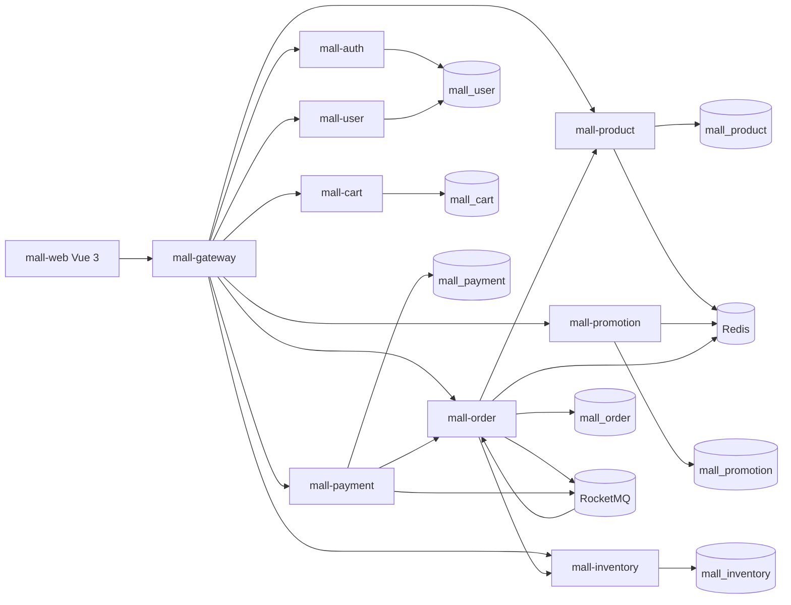
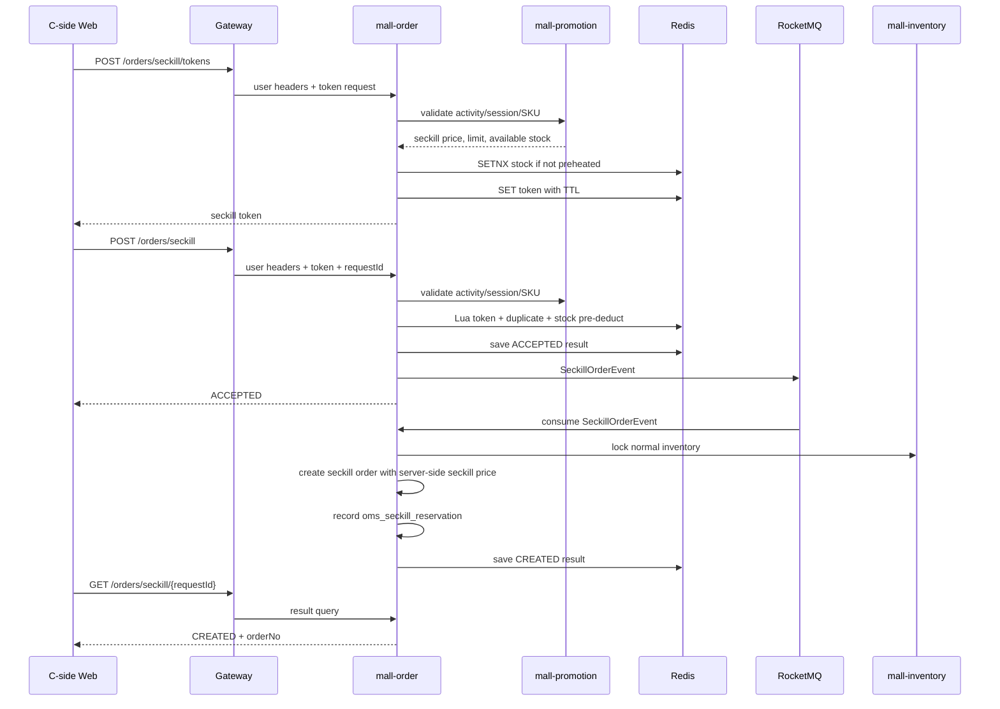
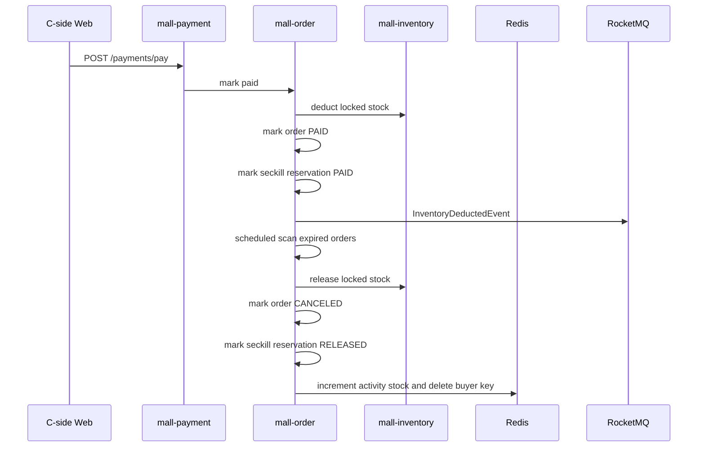
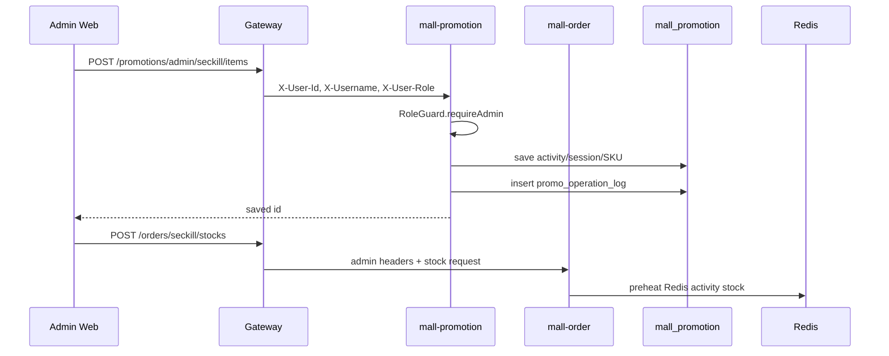

# Architecture

## Service Topology

## Seckill Request Flow

## Payment And Timeout Flow

## Admin Operation Flow

## Consistency Model

- Redis owns hot-path seckill pre-deduct stock during the sale.
- `mall-promotion` owns activity/session/SKU configuration and periodically reconciles Redis stock into `promo_seckill_sku.available_stock`.
- `mall-order` owns order status and seckill reservation state.
- `mall-inventory` owns normal SKU stock locks and final deduction.
- Payment success marks order paid and confirms the seckill reservation.
- Payment timeout or cancel releases normal inventory and Redis seckill stock.
